# Validation results

Generated from a real run of `abiyss-robotics scenario all --window --screenshots` (seed 1337).
Engine: Godot 4.7.2-stable (official), Jolt Physics at 1000 Hz, renderer `gl_compatibility` on `llvmpipe (LLVM 20.1.2, 256 bits)` (software, Xvfb).
Headless runs produce the same numbers (lockstep, seeded noise). Raw reports: [`validation/`](validation/).

| scenario | result | simulated s | wall s |
|---|---|---|---|
| TEST 1 - write('OI') on paper | PASS | 16.84 | 49.89 |
| TEST 2 - pick and place 4 objects of different mass | PASS | 51.3 | 139.84 |
| TEST 3 - force a shoulder stall | PASS | 8.32 | 23.35 |
| TEST 4 - repeatability (20 identical moves) | PASS | 105.6 | 302.91 |
| TEST 5 - gravity: power off the shoulder servo | PASS | 5.1 | 14.6 |
| E-STOP during writing | PASS | 8.2 | 22.39 |
| PID step response (elbow), gains changed at runtime | PASS | 8.66 | 23.15 |
| cam.frame() from the end effector | PASS | 2.06 | 6.69 |
| Stability: reach out with a clamped vs a free-standing base | PASS | 4.96 | 14.08 |

## TEST 1 — write "OI"

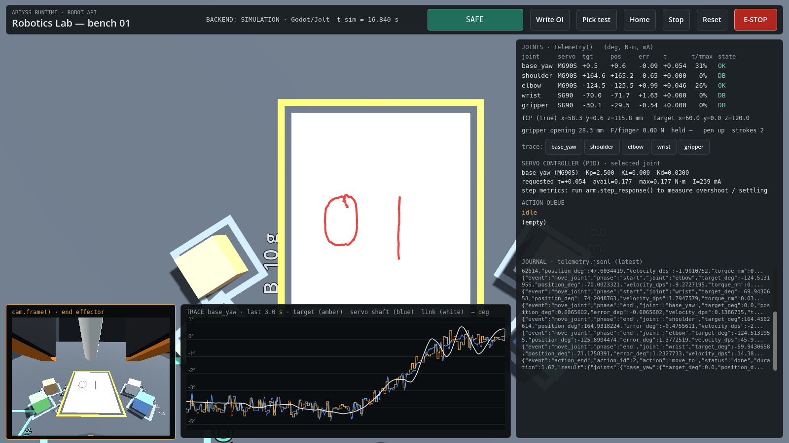

Two strokes. The controller only sends IK-derived pulse widths (pen tip commanded 1.5 mm below the paper, 30 mm above it between strokes, 20 mm/s); the ink is physics ground truth from the tip contact. Mean deviation from the ideal strokes **1.12 mm** (RMS 1.51, max 5.16 mm); 61.1 % of the ideal path has ink within 1 mm; 2 ink strokes for 2 ideal strokes; 677 ink samples; action took 15.18 s simulated.

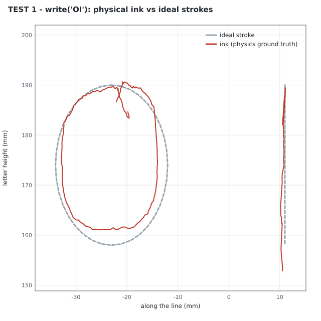

Where the imperfection comes from (all visible in the plot): the O does not close cleanly (dead band + backlash at the stroke reversal), the side nearest the robot is flattened (shoulder/elbow sag under the pen load with P-type servos), edges wobble (pulse jitter and dead-band hunting), and the I ends with a tail where the pen keeps touching while the joints unload during the lift.

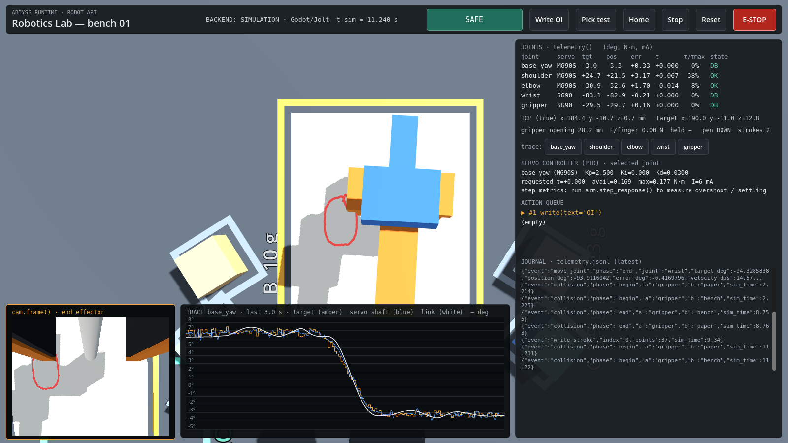

| check | result | detail |
|---|---|---|
| write action completed | PASS | |
| ink was deposited by the physical pen contact | PASS | `677` |
| both letters are present (>= 2 ink strokes) | PASS | `2` |
| ink follows the letters (coverage within 1 mm >= 40%) | PASS | `0.6111` |
| result is imperfect (mean deviation > 0.2 mm) | PASS | `1.116` |
| no FAULT/STALL during writing | PASS | `"SAFE"` |

## TEST 2 — pick 4 objects of different mass

| object | mass g | μ | outcome | lift mm | placement error mm | peak shoulder τ/τmax | stall |
|---|---|---|---|---|---|---|---|
| A foam cube | 4.0 | 0.8 | **held_and_placed** | 48.34 | 2.68 | 1.04 | — |
| B wood cube | 10.0 | 0.5 | **held_and_placed** | 47.83 | 2.58 | 1.21 | — |
| C solid PLA cube | 19.0 | 0.35 | **held_and_placed** | 44.45 | 5.11 | 1.17 | — |
| D steel cube | 123.0 | 0.25 | **torque_insufficient** | — | — | 2.84 | shoulder: 0.448/0.177 N·m |

Light grip (C, commanded width 24.6 mm on a 25 mm cube): **escaped**, lift -0.0 mm. A closing command only 0.4 mm narrower than the object asks for ~1 deg of servo travel, inside the SG90 dead band (10 us = 1.8 deg): the amplifier never drives, the jaws exert ~no force and the object stays behind.

Objects placed earlier, checked after the whole run: `{"A": {"moved_mm": 0.38, "tilt_deg": 0.66}, "B": {"moved_mm": 0.05, "tilt_deg": 0.0}, "C": {"moved_mm": 0.04, "tilt_deg": 0.0}}`.

Cases demonstrated: held (A, B, C), insufficient torque (D: shoulder stall), escape (C with a dead-band grip), loss of stability (free-standing base, below).

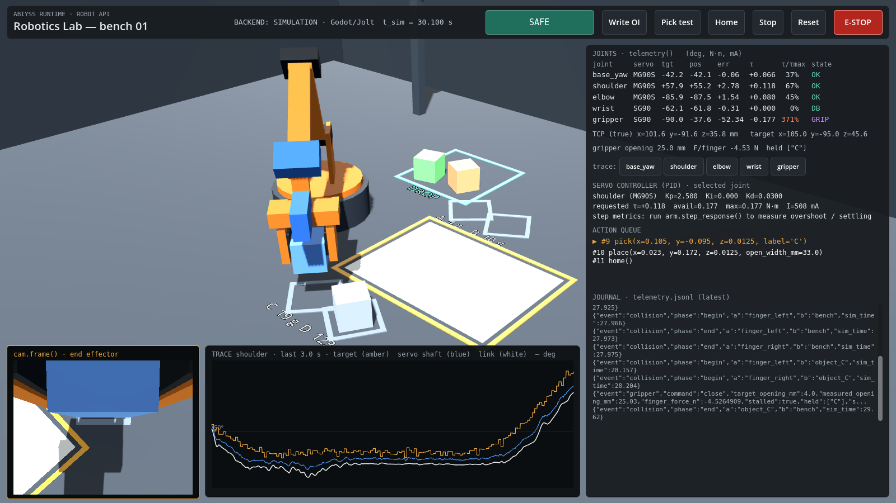

| check | result | detail |
|---|---|---|
| objects of 4 different masses were attempted | PASS | |
| a light object is held, lifted and placed | PASS | `{"A": "held_and_placed", "B": "held_and_placed", "C": "held_and_placed", "D": "torque_insufficient", "C_light_grip": "escaped"}` |
| insufficient torque is detected for the heavy object | PASS | `[{"event": "servo_stall", "seq": 903, "joint": "shoulder", "servo": "MG90S", "requested_torque": 0.44789, "maximum_torque": 0.17652, "ava...` |
| an object escapes when the grip force is too low | PASS | `-0.0` |
| placed objects are not disturbed by later placements (< 5 mm, < 10 deg) | PASS | `{"A": {"moved_mm": 0.38, "tilt_deg": 0.66}, "B": {"moved_mm": 0.05, "tilt_deg": 0.0}, "C": {"moved_mm": 0.04, "tilt_deg": 0.0}}` |

## TEST 3 — forced shoulder stall

| case | joint | requested N·m | maximum N·m | position ° | target ° | arm-only model N·m | probable cause | payload ≥ |
|---|---|---|---|---|---|---|---|---|
| 123 g payload | shoulder | 0.37553 | 0.17652 | 24.927 | 36.65 | 0.0779 | overload by payload: gripper is closed on an object; arm alone needs 0.078 N*m of 0.177; payload >= 61 g | 0.061 kg |
| tool pressed into bench | shoulder | -1.04924 | 0.17652 | 37.447 | 11.942 | 0.06676 | external load or obstruction: arm alone needs 0.067 N*m of 0.177; the rest comes from contact, an obstacle or a hard stop | n/a (pushing with gravity) |

While STALL was latched a new command was rejected: **True**. Example event (as journaled):

```json
{"available_torque": 0.17652, "current_a": 0.75, "event": "servo_stall", "gripper_holding": true, "joint": "shoulder", "maximum_torque": 0.17652, "payload_lower_bound_kg": 0.0612, "position_deg": 24.927, "probable_cause": "overload by payload: gripper is closed on an object; arm alone needs 0.078 N*m of 0.177; payload >= 61 g", "requested_torque": 0.37553, "servo": "MG90S", "sim_time": 5.56, "static_torque_model": 0.0779, "target_deg": 36.65, "time": 5.56}
```

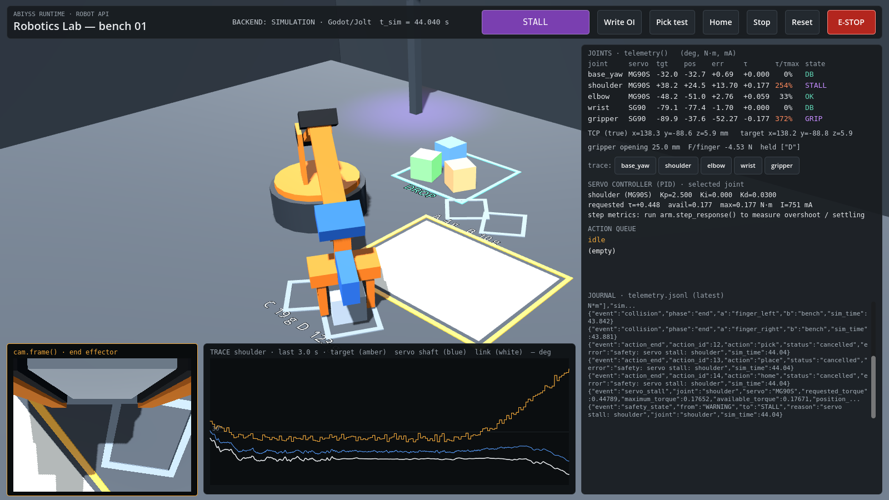

| check | result | detail |
|---|---|---|
| shoulder stall detected under payload | PASS | `["shoulder"]` |
| requested torque exceeds the servo maximum | PASS | `{"requested": 0.37553, "maximum": 0.17652}` |
| stall event is auditable (joint, torques, position, time) | PASS | |
| state machine entered STALL | PASS | `"STALL"` |
| commands are rejected while STALL is latched | PASS | |
| obstruction stall detected (tool pressed into the bench) | PASS | `["shoulder"]` |

## TEST 4 — repeatability (20 identical moves)

Target TCP [160.0, 0.0, 40.0] mm, approached 20 times. Final TCP measured from physics after 0.5 s settling.

| experiment | n | std x/y/z mm | dispersion RMS mm | dispersion max mm | mean error to target mm |
|---|---|---|---|---|---|
| same approach side | 20 | [1.0571, 1.1062, 0.8266] | 1.739 | 3.6606 | 10.12 |
| alternating sides | 20 | [0.76, 2.1296, 0.8071] | 2.4009 | 4.3847 | 10.405 |
|   approached from the left | 10 | [0.5867, 1.3389, 0.8981] | 1.7157 | 2.8481 | 10.594 |
|   approached from the right | 10 | [0.8408, 1.202, 0.5985] | 1.5843 | 2.2193 | 10.215 |
| ablation: dead band, backlash, jitter OFF | 20 | [0.0764, 0.0937, 0.0672] | 0.1384 | 0.4509 | 7.938 |

Approach-direction hysteresis (distance between the left and right mean end points): **3.4851 mm**. The ~10 mm mean error to target is gravity sag of the proportional servos (the controller is open loop on joint pulses, like a host driving hobby servos). With the three effects disabled the dispersion collapses: they change the physics, not just the picture.

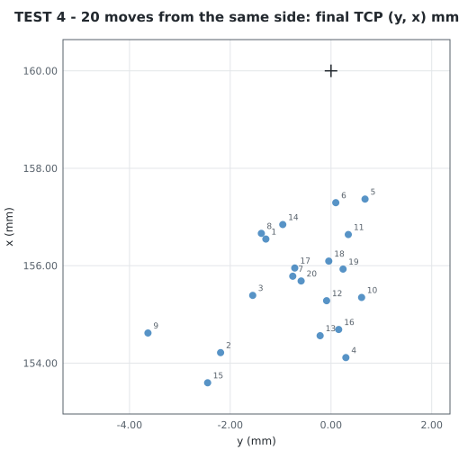 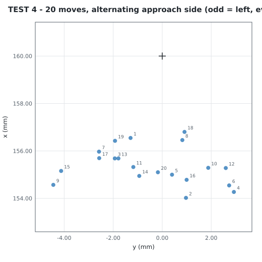

Backlash and jitter as seen live (wrist SG90 holding still for 3 s: measured pulse jumps, the shaft hunts inside the 1.8° dead band, the link rattles in the gear play):

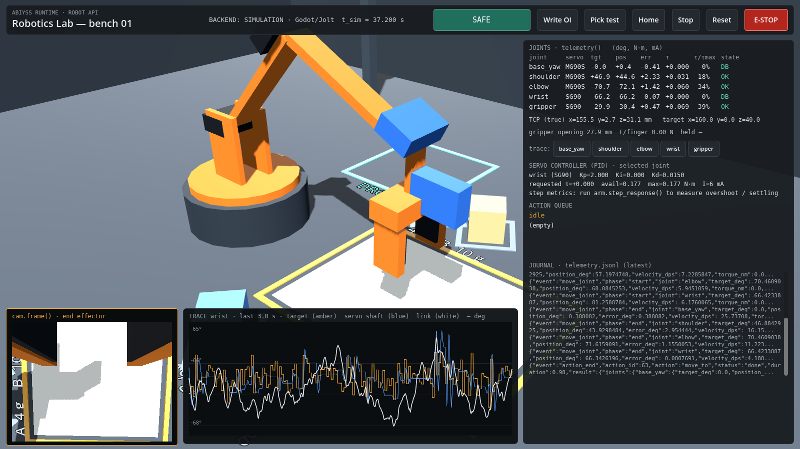

| check | result | detail |
|---|---|---|
| 20 trials recorded for the same move | PASS | |
| final positions disperse (effects are physical, not cosmetic) | PASS | `1.739` |
| approach direction changes the final position (backlash/dead band hysteresis) | PASS | `3.4851` |
| disabling dead band/backlash/jitter collapses the dispersion | PASS | `{"with": 2.4009, "without": 0.1384}` |

## TEST 5 — gravity (shoulder servo powered off)

Pose {'base_yaw': 0.0, 'shoulder': 60.0, 'elbow': -50.0, 'wrist': -40.0}. Powered hold range over 1 s: 1.028°. After power-off the shoulder dropped **37.06°** and the tool reached the bench after 0.26 s.

Model check: shoulder subtree inertia Python 0.0014753 kg·m² vs Godot/Jolt 0.0014759 kg·m². Rigid-pendulum prediction over the first 0.06 s (while the powered elbow stays within 2° — valid until 0.08 s): -4.377° vs measured -4.65°.

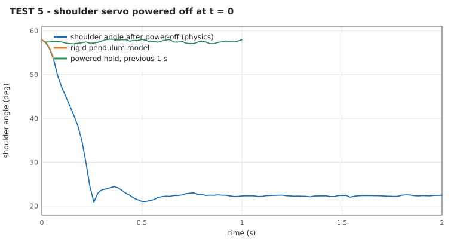

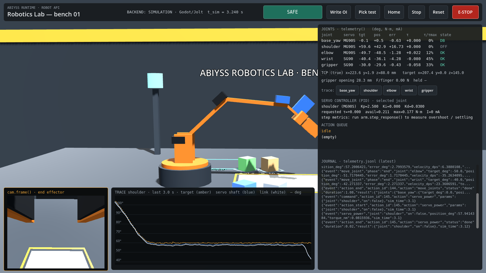

| check | result | detail |
|---|---|---|
| powered servo holds the pose (range < 3 deg over 1 s) | PASS | `1.028` |
| unpowered shoulder falls under gravity (> 20 deg) | PASS | `37.06` |
| Python mass model and Godot plant agree on the shoulder inertia (5%) | PASS | `{"python": 0.0014753, "godot": 0.0014759}` |
| fall over the first 0.06 s matches a rigid pendulum model within 25% | PASS | `{"measured_deg": -4.65, "model_deg": -4.377, "ratio": 1.062}` |

## Emergency stop

E-STOP during `write("OI")`: state `EMERGENCY_STOP`, queue after `[]`, pose drift in 1 s 1.145°, new command rejected **True**, explicit reset → `SAFE`.

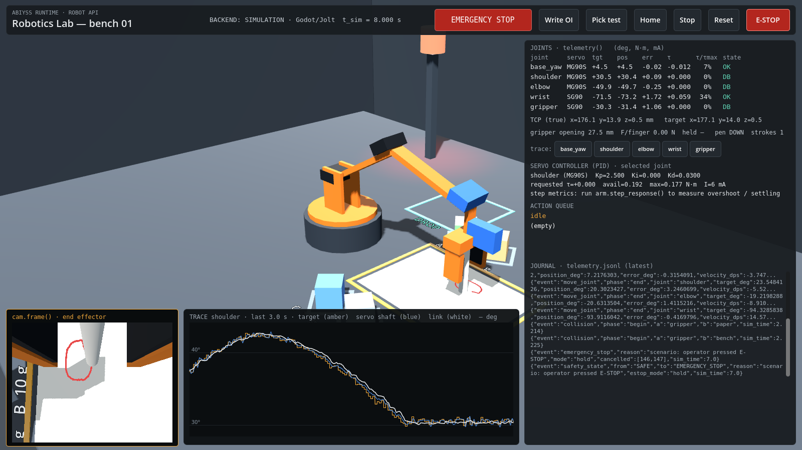

| check | result | detail |
|---|---|---|
| state is EMERGENCY_STOP | PASS | `"EMERGENCY_STOP"` |
| queue cleared | PASS | |
| new commands rejected | PASS | |
| arm holds position (drift < 5 deg in 1 s) | PASS | `1.145` |
| explicit reset returns to SAFE | PASS | `"SAFE"` |

## PID step response (elbow, gains changed at runtime)

| gains | overshoot % | rise s | settling s | oscillations | steady-state error ° |
|---|---|---|---|---|---|
| default (Kp 2.50, Ki 0.00, Kd 0.0300) | 18.062 | 0.180 | — | 3 | 0.5266 |
| Kp x2, Kd x0.3 (Kp 5.00, Ki 0.00, Kd 0.0090) | 19.523 | 0.100 | 1.320 | 3 | 1.5327 |
| with Ki (Kp 2.50, Ki 3.00, Kd 0.0300) | 26.268 | 0.100 | — | 3 | 0.5989 |

Settling uses a band of max(5 % of the step, servo dead band) around the final value; `—` = it keeps hunting outside the band during the 1.5 s window.

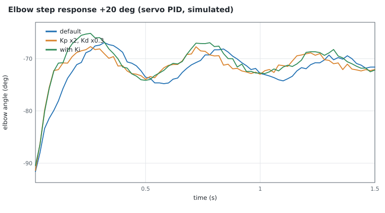

## Camera (`cam.frame()`)

320x240 png, pose {'position': [0.136367, 0.08839699999999999, 0.0975505], 'forward': [-0.049771199999999995, -0.030943599999999998, -0.9982812]}, intrinsics {'fov_y_deg': 70.0, 'fx': 171.37776080905377, 'fy': 171.37776080905377, 'cx': 160.0, 'cy': 120.0}.

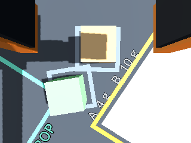 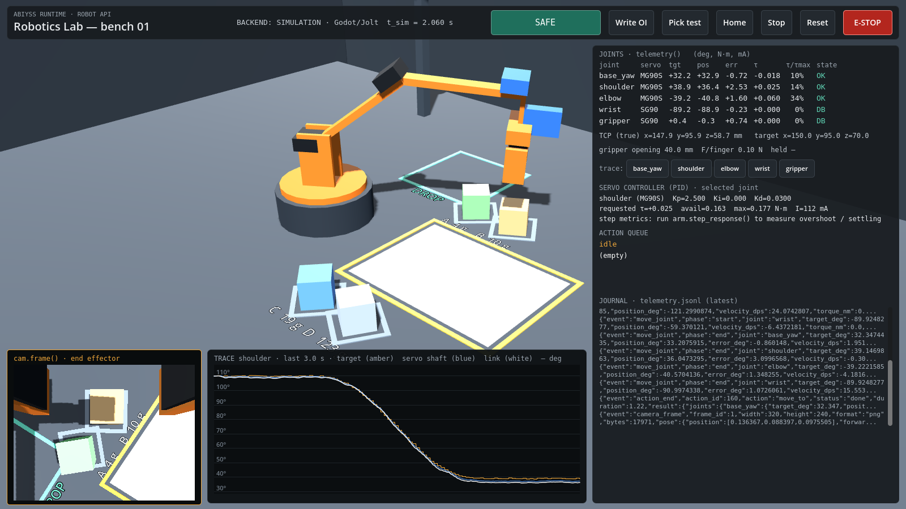

| check | result | detail |
|---|---|---|
| arm moved above object B before capturing | PASS | |
| camera is above object B (< 30 mm horizontally) | PASS | `[0.1364, 0.0884]` |
| frame has the configured resolution | PASS | `[320, 240]` |
| frame is a PNG | PASS | |
| frame carries pose and intrinsics | PASS | |

## Stability (arm loses stability)

Reaching out to (shoulder 10°, elbow 0°, wrist −20°): combined centre of mass x = 0.0656 m vs base radius 0.045 m. Max base tilt: clamped 0.0°, free-standing **20.11°** (it tips until the gripper rests on the bench).

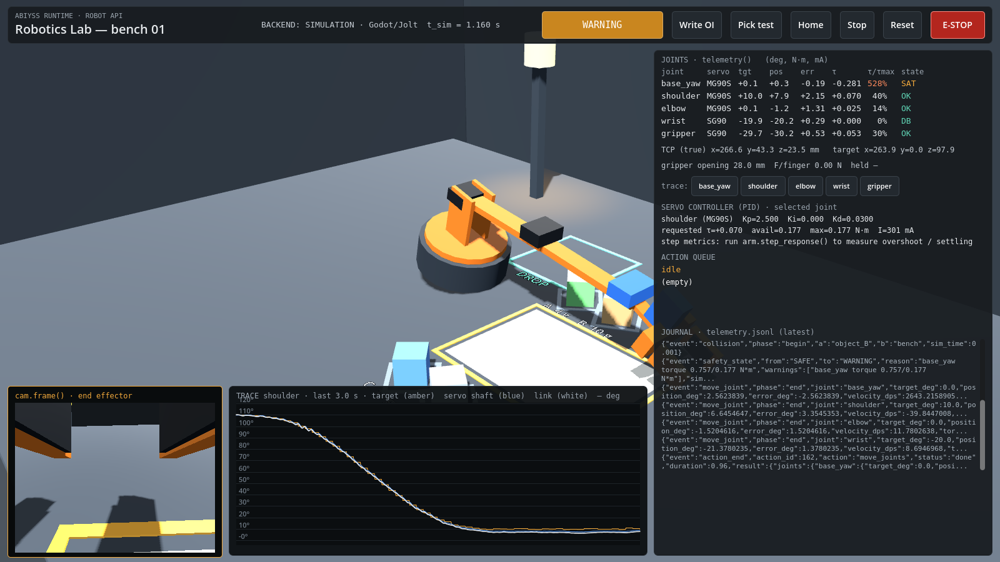

| check | result | detail |
|---|---|---|
| clamped base stays put (design default) | PASS | `0.0` |
| static model predicts tipping (combined COM beyond the base edge) | PASS | `{"com_x_m": 0.0656, "base_radius_m": 0.045}` |
| free-standing base lifts off and tips (> 5 deg): the arm loses stability | PASS | `20.11` |

## Telemetry journal

4138 records in this run. Events: `joint_state` 2205, `move_joint` 1141, `collision` 217, `command` 163, `action_start` 160, `action_end` 160, `safety_state` 26, `reset` 19, `gripper` 16, `pid_config` 4, `write_plan` 3, `pick_result` 3, `place_result` 3, `servo_stall` 3, `servo_stall_cleared` 3, `pid_metrics` 3, `write_stroke` 2, `command_rejected` 2, `run_start` 1, `servo_power` 1, `emergency_stop` 1, `camera_frame` 1, `run_end` 1.
A sample (first 400 records, TEST 1) is in [`validation/telemetry_sample.jsonl`](validation/telemetry_sample.jsonl).

## Screenshot index

* [1. complete lab](screenshots/01_lab_overview.png)
* [2. arm at rest](screenshots/02_arm_at_rest.png)
* [3. arm writing OI](screenshots/03_writing_OI.png)
* [03b_OI_result](screenshots/03b_OI_result.png)
* [4. pick-and-place](screenshots/04_pick_and_place.png)
* [5. telemetry panel](screenshots/05_telemetry_panel.png)
* [6. stall](screenshots/06_stall.png)
* [7. backlash/jitter visible](screenshots/07_backlash_jitter.png)
* [8. arm falling after servo off](screenshots/08_gravity_fall.png)
* [9. end-effector camera frame](screenshots/09_cam_frame.png)
* [09b_camera_hud](screenshots/09b_camera_hud.png)
* [10. emergency state](screenshots/10_emergency_stop.png)
* [11_unstable_free_base](screenshots/11_unstable_free_base.png)
