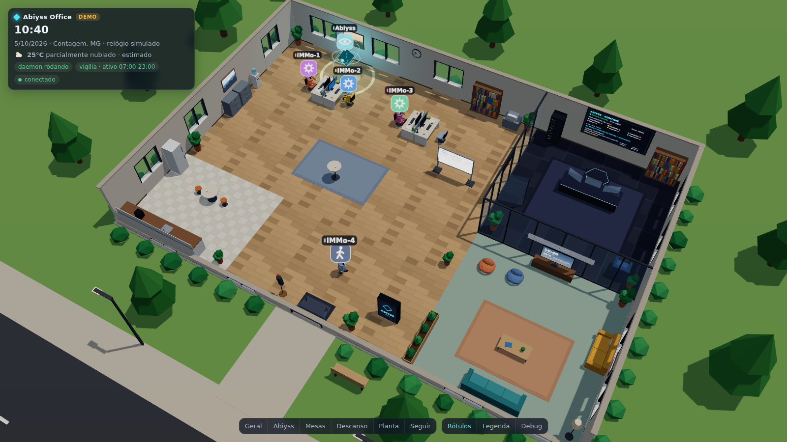
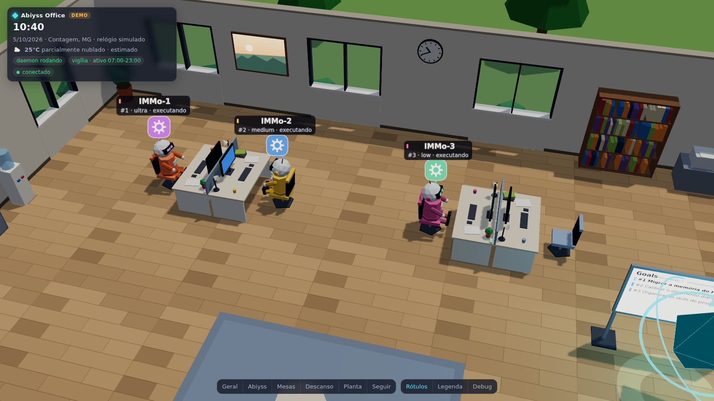
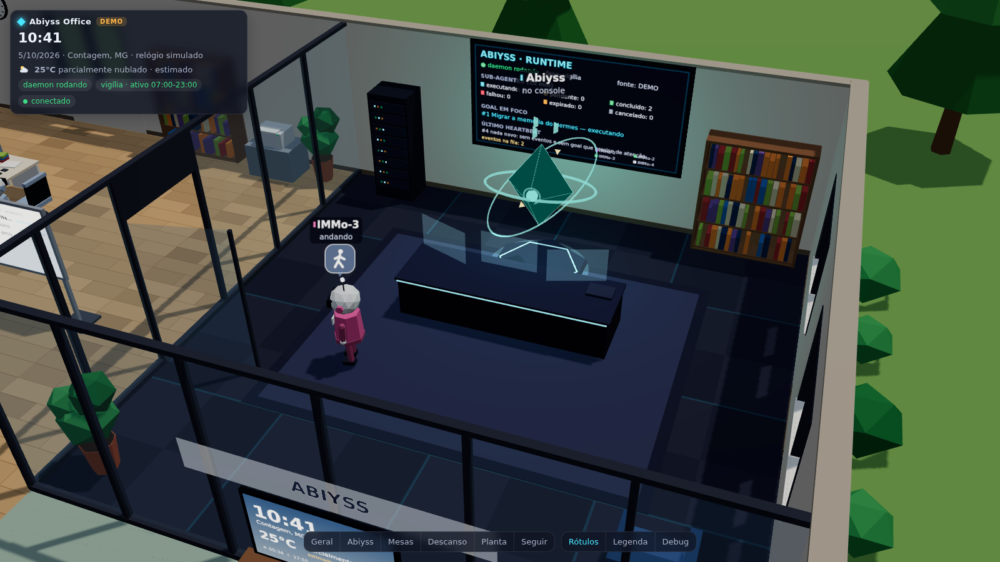
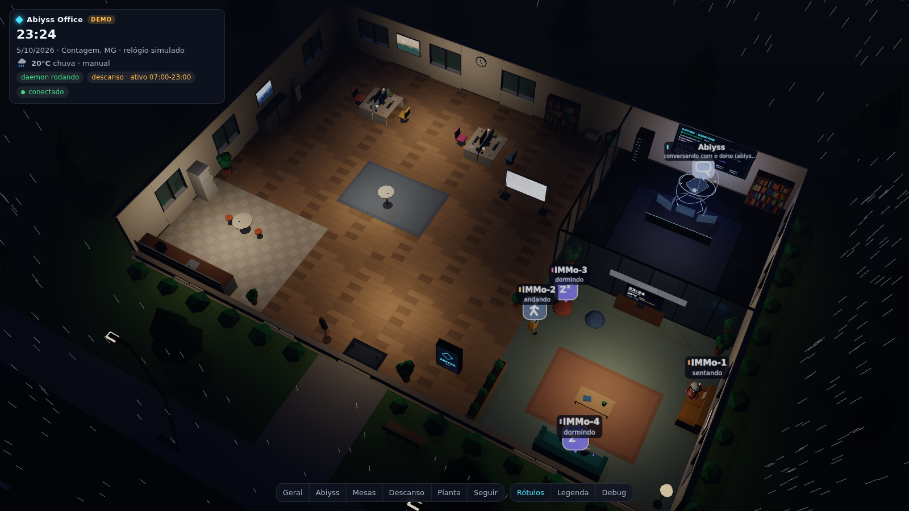
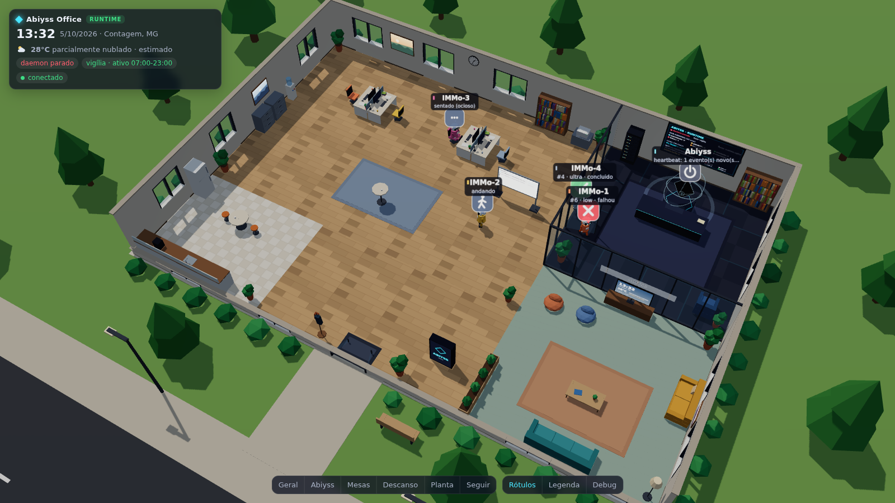

# Abiyss Office

Escritório 3D low-poly que **representa, em tempo real, o estado do runtime
multiagente do Abiyss**: o Abiyss é a entidade central (o chefe) e os IMMos
são os trabalhadores — cada IMMo é uma vaga do executor de sub-agentes do
runtime. Quando o daemon delega um sub-agente, um IMMo vai até a sua mesa e
trabalha; quando o sub-agente termina, ele leva o relatório ao Abiyss;
quando está livre, passeia, toma café, conversa, descansa no sofá e dorme à
noite. Hora, sol e clima seguem Contagem (MG).



| | |
|---|---|
|  |  |
|  |  |

Não é uma maquete: é um **servidor de simulação autoritativo** (Node.js,
sem dependências) com navegação A*, máquinas de estado, persistência e
sincronização por SSE, mais um **cliente web three.js** que só interpola e
desenha. Todos os modelos são procedurais (primitivas), sem assets externos.

## Rodar no seu PC (o jeito mais fácil)

1. Instale o **Node.js LTS** (22.13 ou mais novo): <https://nodejs.org/>.
2. Baixe o pacote `abiyss-office-<versão>.zip` (gerado por `npm run pacote`;
   já traz o three.js, não precisa de `npm install`) e descompacte.
3. Rode o lançador:
   - **Windows:** dois cliques em `iniciar-windows.bat`;
   - **Linux/macOS:** no terminal, dentro da pasta, `./iniciar.sh`.
4. O navegador abre em <http://127.0.0.1:8090/>. Para parar, feche a janela
   do terminal (ou Ctrl+C). Da próxima vez ele continua de onde parou; para
   ver a chegada dos IMMos de novo: `iniciar-windows.bat --fresh`.

Também dá para clonar a branch e usar os mesmos lançadores (eles instalam
o three.js com `npm ci --omit=dev` na primeira vez).

No seu PC a cena roda na GPU (na VM de desenvolvimento, sem GPU, era 1–3
FPS em CPU) e, com internet, o clima de Contagem vem **ao vivo** da
Open-Meteo.

## Requisitos

- Node.js **≥ 22.13** (usa o `node:sqlite` embutido) — funciona em x86_64 e arm64;
- um navegador com WebGL2 para ver a cena;
- opcional: o runtime do Abiyss (kernel em Rust) para ver o estado real;
- opcional (só para screenshots): Chromium do Playwright (`npx playwright install chromium`).

## Instalação

```bash
cd office
npm ci            # instala three (cliente) e playwright (dev, só screenshots)
npm test          # 43 testes, ~4 s
```

## Executar

```bash
npm run demo      # demonstração: emulador do runtime, IMMos entram pela porta
npm start         # modo auto: runtime real se ../data/abiyss.db existir, senão demo
npm run runtime   # força o runtime real (lê ../data/abiyss.db e ../abiyss.toml)
```

Abra **http://127.0.0.1:8090/**. Opções úteis:

```bash
node server/main.js --source runtime --runtime-db /caminho/data/abiyss.db --runtime-config /caminho/abiyss.toml
node server/main.js --source demo --fresh --clock 2026-10-05T21:30:00-03:00 --time-scale 3   # ver a noite
node server/main.js --source demo --weather storm     # forçar o clima (clear|cloudy|overcast|fog|drizzle|rain|storm)
node server/main.js --help
```

### Com o runtime real, sem gastar cota

O runtime traz um NIM de mentira. Este script monta um projeto temporário,
sobe `abiyss mock-nim` + `abiyss daemon` reais e o escritório lendo o banco
deles:

```bash
# no repositório do runtime (branch claude/determined-carson-6qrkl4)
cargo build --release
# aqui
scripts/runtime-live.sh --binario /caminho/do/runtime/target/release/abiyss
```

### Controles

| | |
|---|---|
| arrastar / botão direito / roda | girar / mover / zoom |
| `1`–`5` ou botões | visões: Geral, Abiyss, Mesas, Descanso, Planta |
| `F` / `Esc` | seguir a próxima entidade / soltar |
| `L` | rótulos (nome + estado → só nome → nenhum) |
| `D` | painel de debug (estado de todos, destinos, FPS, sincronização, fonte) |
| `P` | caminhos e destinos no chão |
| `?` | legenda de cores e ícones |

URL: `?debug=1`, `?labels=0|1|2`, `?view=abiyss`, `?q=low` (máquinas fracas).

## Como ler a cena

- **IMMo trabalhando**: sentado na própria mesa, digitando; antena, monitor
  e LED da mesa na cor do nível do sub-agente (violeta = ultra, azul =
  medium, verde = low); rótulo `#id · nível · executando`.
- **Relatório**: o IMMo leva uma folha ao console do Abiyss; ✔ concluído,
  ✘ falhou, ampulheta = expirado.
- **Abiyss**: anéis rápidos e pulso no chão = pensando (heartbeat que chamou o
  modelo); dourado = delegando (uma esfera de luz voa até o IMMo); verde =
  recebendo relatório; satélites dourados = eventos na fila; violeta no
  pedestal = sono; apagado = daemon parado.
- **Paredes da sala do Abiyss**: painel com o status real do runtime; o
  quadro branco mostra os goals; a TV da área de descanso mostra hora e clima.

## Configuração

`config/office.config.json` (mesclado com `--config ARQ`, variáveis e
argumentos; caminhos relativos à pasta `office/`):

| Chave | Padrão | Uso |
|---|---|---|
| `server.host` / `server.port` | `127.0.0.1` / `8090` | escuta HTTP (`OFFICE_HOST`, `OFFICE_PORT`) |
| `server.broadcastHz` | `10` | quadros por segundo para os clientes |
| `simulation.tickHz` | `10` | passos de simulação por segundo |
| `simulation.seed` | `20260927` | semente (determinismo) |
| `simulation.timeScale` | `1` | acelerar (só demo) |
| `simulation.stateFile` | `data/office-state.json` | estado salvo (posições e atribuições) |
| `source.mode` | `auto` | `auto` \| `runtime` \| `demo` (`OFFICE_SOURCE`) |
| `source.pollIntervalMs` | `1000` | leitura do runtime |
| `source.runtime.db` | `../data/abiyss.db` | banco do runtime (`ABIYSS_DB`) |
| `source.runtime.config` | `../abiyss.toml` | lê `[ritmo] horas_ativas`, `[daemon] cron_verificacao_segundos` |
| `ritmo.horasAtivas` | `07:00-23:00` | usado quando não há `abiyss.toml` |
| `location` | Contagem, MG (−19,9317; −44,0536), `America/Sao_Paulo` | sol, hora local, clima |
| `weather.provider` | `open-meteo` | `none` desliga a busca |
| `weather.refreshMinutes` | `10` | atualização do clima |
| `weather.override` | `null` | forçar condição (`--weather`) |
| `clock.start` | `null` | instante inicial do relógio (só demo, `--clock`) |
| `log.level` / `log.file` | `info` / `null` | `--log-level`, `--log-file` |
| `privacy.showTaskText` / `maxTaskChars` | `true` / `90` | mostrar (truncado) o texto das tarefas |

## Clima e luz de Contagem

O servidor busca o tempo atual na [Open-Meteo](https://open-meteo.com)
(sem chave) a cada 10 min e calcula a posição real do sol. Isso define a cor
do céu, a direção e a cor da luz (sol baixo e quente no fim da tarde), as
nuvens, a chuva, os relâmpagos, a neblina e quando as lâmpadas acendem. O
clima também mexe no comportamento (frio → mais café; calor → mais água).
Se a API não responder, o escritório usa uma **estimativa climatológica**
da região, marcada como "estimado" no HUD e na TV.

> Nesta VM de desenvolvimento a rede bloqueou `api.open-meteo.com` (403);
> por isso as capturas mostram "estimado" ou "manual". Em uma máquina com
> acesso, o HUD mostra "ao vivo".

## Documentação

- [docs/TECNOLOGIA.md](docs/TECNOLOGIA.md) — inspeção da VM, engines avaliadas, escolha e limitações
- [docs/ARQUITETURA.md](docs/ARQUITETURA.md) — módulos, laço, navegação, renderização, desempenho
- [docs/ESTADOS.md](docs/ESTADOS.md) — DSR (não existe no repositório), estados do runtime e mapeamento visual
- [docs/SINCRONIZACAO.md](docs/SINCRONIZACAO.md) — leitura do runtime, ponte, protocolo SSE, persistência
- [docs/RELATORIO_DE_TESTES.md](docs/RELATORIO_DE_TESTES.md) — testes, soak, integração com o runtime real, screenshots
- [docs/PROXIMOS_PASSOS.md](docs/PROXIMOS_PASSOS.md) — integração futura com o runtime

## Garantias e limites

- O escritório **nunca escreve** no banco do runtime (conexão somente
  leitura, provado em teste).
- Nenhum LLM participa de navegação, animação, temporização ou transições:
  tudo é código determinístico com semente.
- Não existe especificação "DSR" nem "IMMo" no repositório; a camada de
  sincronização é provisória e isolada em `server/dsr/` (ver
  [ESTADOS.md](docs/ESTADOS.md)).
- Sem GPU, a cena roda em CPU (SwiftShader) a 1–3 FPS — suficiente para
  screenshots; com GPU é leve (~400 draw calls).
